# Diagrama: Sistema de Verificação de Duplicidade

## 🏛️ Visão Geral da Arquitetura

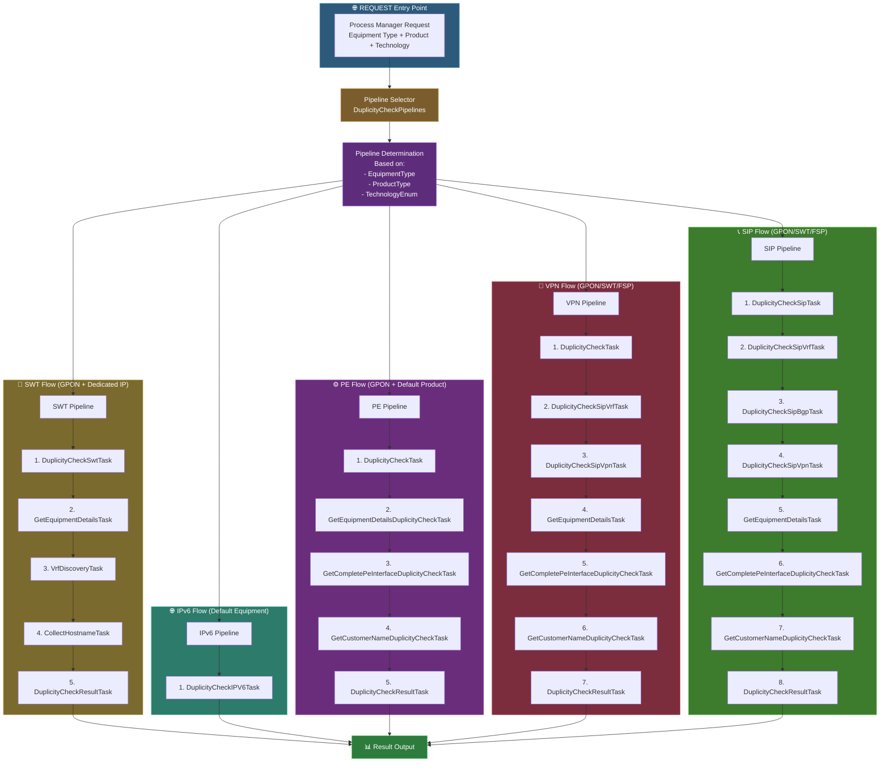

---

## 🔄 Fluxo Detalhado: Seleção de Pipeline

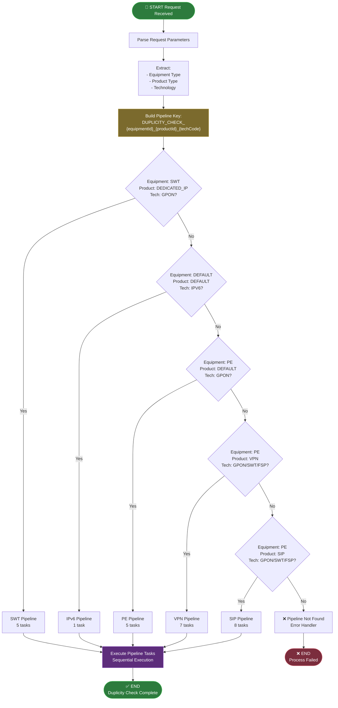

---

## 🔄 Fluxo Detalhado: SWT Pipeline (GPON + Dedicated IP)

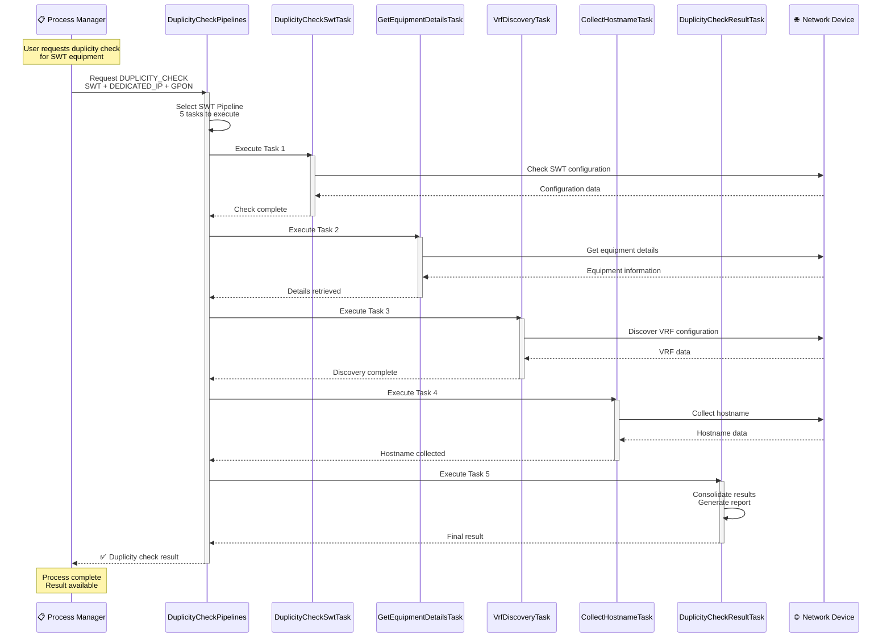

---

## 🔄 Fluxo Detalhado: SIP Pipeline (GPON/SWT/FSP)

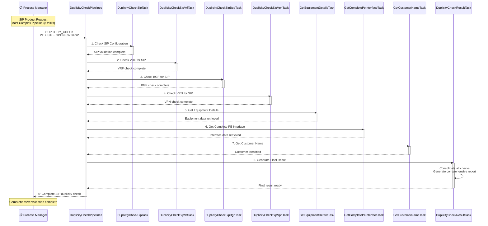

---

## 🔄 Fluxo Detalhado: VPN Pipeline (GPON/SWT/FSP)

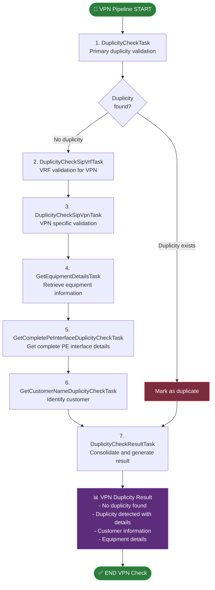

---

## 📦 Estrutura de Pipelines

### Pipeline Configuration

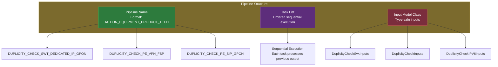

### Task Dependencies

```java
@Component
public class DuplicityCheckPipelines implements ModulePipelines {
    
    // Core Tasks (All Pipelines)
    private final DuplicityCheckTask duplicityCheckTask;
    private final DuplicityCheckResultTask duplicityCheckResultTask;
    
    // Equipment Tasks
    private final GetEquipmentDetailsTask getEquipmentDetailsTask;
    private final GetEquipmentDetailsDuplicityCheckTask getEquipmentDetailsDuplicityCheckTask;
    
    // Interface Tasks
    private final GetCompleteInterfaceTask getCompleteInterfaceTask;
    private final GetCompletePeInterfaceDuplicityCheckTask getCompletePeInterfaceDuplicityCheckTask;
    
    // SIP-specific Tasks
    private final DuplicityCheckSipTask duplicityCheckSipTask;
    private final DuplicityCheckSipBgpTask duplicityCheckSipBgpTask;
    private final DuplicityCheckSipVrfTask duplicityCheckSipVrfTask;
    private final DuplicityCheckSipVpnTask duplicityCheckSipVpnTask;
    
    // SWT-specific Tasks
    private final DuplicityCheckSwtTask duplicityCheckSwtTask;
    private final VrfDiscoveryTask vrfDiscoveryTask;
    private final CollectHostnameTask collectHostnameTask;
    
    // IPv6-specific Tasks
    private final DuplicityCheckIPV6Task duplicityCheckIPV6Task;
    
    // Customer Tasks
    private final GetCustomerNameDuplicityCheckTask getCustomerNameDuplicityCheckTask;
}
```

---

## 📊 Pipeline Matrix

```mermaid
graph TB
    subgraph Matrix["Pipeline Configuration Matrix"]
        subgraph Row1["Equipment: SWT"]
            SWT_DED["Product: DEDICATED_IP<br/>Tech: GPON<br/>Tasks: 5"]
        end
        
        subgraph Row2["Equipment: DEFAULT"]
            DEF_IPV6["Product: DEFAULT<br/>Tech: IPV6<br/>Tasks: 1"]
        end
        
        subgraph Row3["Equipment: PE - Default"]
            PE_DEF["Product: DEFAULT<br/>Tech: GPON<br/>Tasks: 5"]
        end
        
        subgraph Row4["Equipment: PE - VPN"]
            PE_VPN_GPON["Product: VPN<br/>Tech: GPON<br/>Tasks: 7"]
            PE_VPN_SWT["Product: VPN<br/>Tech: SWT<br/>Tasks: 7"]
            PE_VPN_FSP["Product: VPN<br/>Tech: FSP<br/>Tasks: 7"]
        end
        
        subgraph Row5["Equipment: PE - SIP"]
            PE_SIP_GPON["Product: SIP<br/>Tech: GPON<br/>Tasks: 8"]
            PE_SIP_SWT["Product: SIP<br/>Tech: SWT<br/>Tasks: 8"]
            PE_SIP_FSP["Product: SIP<br/>Tech: FSP<br/>Tasks: 8"]
        end
    end

    SWT_DED -.->|Simplest SWT flow| Label1["Basic duplicity check<br/>+ Equipment details<br/>+ VRF discovery"]
    
    DEF_IPV6 -.->|Simplest overall| Label2["Single task<br/>IPv6 validation only"]
    
    PE_DEF -.->|Standard PE flow| Label3["Standard duplicity check<br/>+ PE interface details"]
    
    PE_VPN_GPON -.->|Multi-tech VPN| Label4["VPN validation<br/>+ VRF + VPN checks"]
    PE_VPN_SWT -.->|Multi-tech VPN| Label4
    PE_VPN_FSP -.->|Multi-tech VPN| Label4
    
    PE_SIP_GPON -.->|Most complex| Label5["SIP validation<br/>+ VRF + BGP + VPN checks"]
    PE_SIP_SWT -.->|Most complex| Label5
    PE_SIP_FSP -.->|Most complex| Label5

    style Row1 fill:#7b6a2d,stroke:#c4a84a,color:#fff
    style Row2 fill:#2d7b6a,stroke:#4ac4a8,color:#fff
    style Row3 fill:#6a2d7b,stroke:#a84ac4,color:#fff
    style Row4 fill:#7b2d3d,stroke:#c44a5a,color:#fff
    style Row5 fill:#3d7b2d,stroke:#5ac44a,color:#fff
```

---

## 📊 Task Execution Flow

```mermaid
graph LR
    subgraph Input["📥 Input Phase"]
        RequestIn["Process Request<br/>with parameters"]
        ValidateIn["Validate inputs<br/>against model"]
    end

    subgraph Selection["🎯 Selection Phase"]
        BuildKey["Build pipeline key"]
        FindPipe["Find matching pipeline"]
        LoadTasks["Load task list"]
    end

    subgraph Execution["⚙️ Execution Phase"]
        Task1["Execute Task 1"]
        Task2["Execute Task 2"]
        TaskN["Execute Task N"]
        
        Task1 -->|Output becomes input| Task2
        Task2 -->|Chained execution| TaskN
    end

    subgraph Output["📤 Output Phase"]
        Consolidate["Consolidate results"]
        Format["Format response"]
        Return["Return to Process Manager"]
    end

    RequestIn --> ValidateIn
    ValidateIn --> BuildKey
    BuildKey --> FindPipe
    FindPipe --> LoadTasks
    LoadTasks --> Task1
    TaskN --> Consolidate
    Consolidate --> Format
    Format --> Return

    style Input fill:#2d5a7b,stroke:#4a90c4,color:#fff
    style Selection fill:#7b5d2d,stroke:#c49a4a,color:#fff
    style Execution fill:#5d2d7b,stroke:#8a4ac4,color:#fff
    style Output fill:#2d7b3d,stroke:#4ac45a,color:#fff
```

---

## 🎯 Pontos Chave da Arquitetura

### ✅ Características Principais

- **Modularidade**: Cada pipeline é independente e focado em um tipo específico de equipamento/produto
- **Reutilização**: Tasks são compartilhadas entre pipelines quando aplicável
- **Flexibilidade**: Fácil adicionar novos pipelines sem afetar existentes
- **Type Safety**: Cada pipeline tem seu próprio modelo de input tipado
- **Manutenibilidade**: Separação clara de responsabilidades entre tasks
- **Escalabilidade**: Novos equipamentos/produtos podem ser adicionados facilmente

### 📋 Tipos de Equipamento

| Equipment Type | ID | Descrição |
|----------------|-------|-----------|
| **SWT** | 2 | Switch - Equipamento de comutação |
| **PE** | 3 | Provider Edge - Equipamento de borda |
| **DEFAULT** | 0 | Equipamento genérico |

### 📦 Tipos de Produto

| Product Type | ID | Descrição |
|--------------|-------|-----------|
| **DEFAULT** | 0 | Produto padrão |
| **DEDICATED_IP** | 1 | IP Dedicado |
| **VPN** | 2 | Virtual Private Network |
| **SIP** | 3 | Session Initiation Protocol |

### 🔧 Tipos de Tecnologia

| Technology | Code | Descrição |
|------------|------|-----------|
| **GPON** | GPON | Gigabit Passive Optical Network |
| **SWT** | SWT | Switch Technology |
| **FSP** | FSP | Fiber Service Platform |
| **IPV6** | IPV6 | Internet Protocol version 6 |

### 🔄 Fluxo de Tarefas Comum


### 🎨 Padrões de Task

1. **Check Tasks**: Verificam duplicidade ou configuração
   - `DuplicityCheckTask`
   - `DuplicityCheckSipTask`
   - `DuplicityCheckSwtTask`
   - `DuplicityCheckIPV6Task`

2. **Specialized Check Tasks**: Verificações específicas de protocolo
   - `DuplicityCheckSipBgpTask`
   - `DuplicityCheckSipVrfTask`
   - `DuplicityCheckSipVpnTask`

3. **Get Tasks**: Obtêm informações de recursos
   - `GetEquipmentDetailsTask`
   - `GetEquipmentDetailsDuplicityCheckTask`
   - `GetCompleteInterfaceTask`
   - `GetCompletePeInterfaceDuplicityCheckTask`
   - `GetCustomerNameDuplicityCheckTask`

4. **Discovery Tasks**: Descobrem configurações
   - `VrfDiscoveryTask`
   - `CollectHostnameTask`

5. **Result Tasks**: Consolidam e geram resultado final
   - `DuplicityCheckResultTask`

---

## 🔍 Casos de Uso Detalhados

### Caso 1: SWT + DEDICATED_IP + GPON

**Cenário**: Cliente solicita IP dedicado em equipamento Switch GPON

**Pipeline**: `DUPLICITY_CHECK_2_1_GPON`

**Tasks Executadas**:
1. `DuplicityCheckSwtTask` - Verifica duplicidade na configuração do switch
2. `GetEquipmentDetailsTask` - Obtém detalhes do equipamento
3. `VrfDiscoveryTask` - Descobre VRF configurada
4. `CollectHostnameTask` - Coleta hostname do equipamento
5. `DuplicityCheckResultTask` - Gera resultado consolidado

**Resultado**: Validação se o IP pode ser provisionado sem conflitos

---

### Caso 2: PE + SIP + GPON

**Cenário**: Cliente solicita serviço SIP em equipamento PE GPON

**Pipeline**: `DUPLICITY_CHECK_3_3_GPON`

**Tasks Executadas**:
1. `DuplicityCheckSipTask` - Verifica duplicidade específica de SIP
2. `DuplicityCheckSipVrfTask` - Valida VRF para SIP
3. `DuplicityCheckSipBgpTask` - Valida configuração BGP para SIP
4. `DuplicityCheckSipVpnTask` - Valida VPN para SIP
5. `GetEquipmentDetailsTask` - Obtém detalhes do equipamento PE
6. `GetCompletePeInterfaceDuplicityCheckTask` - Obtém interface completa do PE
7. `GetCustomerNameDuplicityCheckTask` - Identifica cliente
8. `DuplicityCheckResultTask` - Gera resultado final completo

**Resultado**: Validação abrangente incluindo SIP, VRF, BGP, VPN e dados do cliente

---

### Caso 3: DEFAULT + DEFAULT + IPV6

**Cenário**: Cliente solicita validação de endereço IPv6

**Pipeline**: `DUPLICITY_CHECK_0_0_IPV6`

**Tasks Executadas**:
1. `DuplicityCheckIPV6Task` - Valida unicidade do endereço IPv6

**Resultado**: Validação rápida e direta de IPv6 (pipeline mais simples)

---

### Caso 4: PE + VPN + FSP

**Cenário**: Cliente solicita VPN em equipamento PE FSP

**Pipeline**: `DUPLICITY_CHECK_3_2_FSP`

**Tasks Executadas**:
1. `DuplicityCheckTask` - Verificação primária de duplicidade
2. `DuplicityCheckSipVrfTask` - Valida VRF
3. `DuplicityCheckSipVpnTask` - Valida configuração VPN
4. `GetEquipmentDetailsTask` - Obtém detalhes do equipamento
5. `GetCompletePeInterfaceDuplicityCheckTask` - Obtém interface PE completa
6. `GetCustomerNameDuplicityCheckTask` - Identifica cliente
7. `DuplicityCheckResultTask` - Consolida resultado

**Resultado**: Validação completa de VPN com informações de cliente e equipamento

---

## 📈 Comparativo de Complexidade

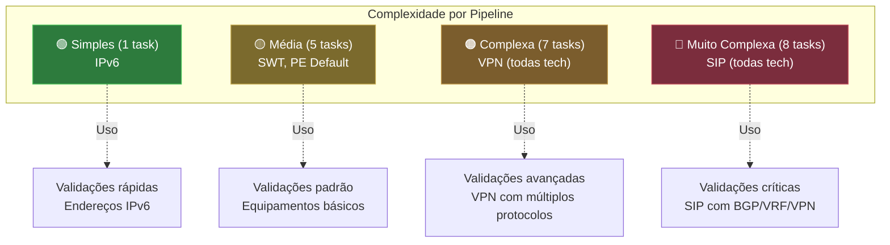

---

## 🔐 Validações de Segurança

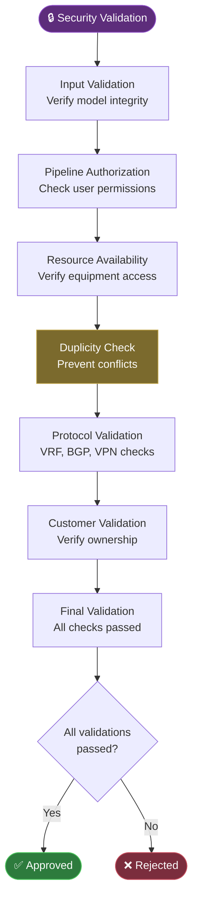

---

## 📊 Estatísticas de Pipelines

### Total de Pipelines Configurados

- **Total**: 9 pipelines
- **Equipamentos**: 3 tipos (SWT, PE, DEFAULT)
- **Produtos**: 4 tipos (DEFAULT, DEDICATED_IP, VPN, SIP)
- **Tecnologias**: 4 tipos (GPON, SWT, FSP, IPV6)

### Distribuição de Tasks

| Pipeline Type | Task Count | Complexity |
|---------------|------------|------------|
| IPv6 | 1 | Baixa |
| SWT + Dedicated IP | 5 | Média |
| PE + Default | 5 | Média |
| PE + VPN (all tech) | 7 | Alta |
| PE + SIP (all tech) | 8 | Muito Alta |

### Tasks Mais Utilizadas

1. `DuplicityCheckResultTask` - Presente em 8 pipelines
2. `GetEquipmentDetailsTask` - Presente em 7 pipelines
3. `GetCustomerNameDuplicityCheckTask` - Presente em 6 pipelines
4. `DuplicityCheckTask` - Presente em 4 pipelines
5. `GetCompletePeInterfaceDuplicityCheckTask` - Presente em 6 pipelines

---

## 🎯 Decisões de Design

### Por que múltiplos pipelines?

1. **Separação de Concerns**: Cada tipo de equipamento/produto tem necessidades específicas
2. **Performance**: Executa apenas as tasks necessárias para cada cenário
3. **Manutenibilidade**: Fácil localizar e modificar lógica específica
4. **Testabilidade**: Cada pipeline pode ser testado independentemente
5. **Escalabilidade**: Novos pipelines não afetam os existentes

### Por que task-based architecture?

1. **Reutilização**: Tasks podem ser compartilhadas entre pipelines
2. **Composição**: Fácil criar novos pipelines combinando tasks existentes
3. **Isolamento**: Cada task tem responsabilidade única e bem definida
4. **Debugging**: Fácil identificar qual task falhou no pipeline
5. **Evolução**: Novas tasks podem ser adicionadas sem modificar existentes

### Por que Spring Component?

1. **Dependency Injection**: Todas as tasks são injetadas automaticamente
2. **Lifecycle Management**: Spring gerencia criação e destruição
3. **Testing**: Fácil mockar dependências em testes
4. **Configuration**: Integração com configurações do Spring
5. **Monitoring**: Integração com métricas e observabilidade

---

## 🔄 Fluxo de Integração

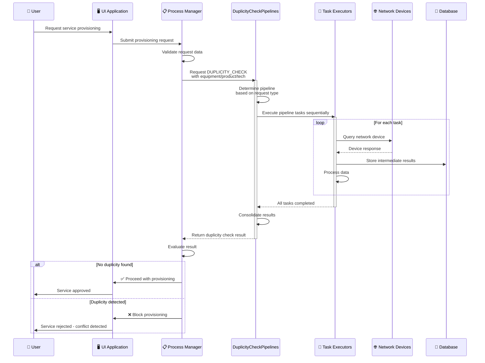

---

## 📝 Exemplo de Código de Uso

### Registering a New Pipeline

```java
new Pipeline(
    PipelineActions.DUPLICITY_CHECK + "_" +
        EquipmentTypeEnum.PE.getIdEquipmentType() + "_" +
        ProductTypeEnum.VPN.getIdProductType() + "_" +
        TecnologyEnum.GPON.getCode(),
    List.of(
        duplicityCheckTask,
        duplicityCheckSipVrfTask,
        duplicityCheckSipVpnTask,
        getEquipmentDetailsTask,
        getCompletePeInterfaceDuplicityCheckTask,
        getCustomerNameDuplicityCheckTask,
        duplicityCheckResultTask
    ),
    DuplicityCheckInputs.class
)
```

### Pipeline Key Format

```
DUPLICITY_CHECK_{equipmentId}_{productId}_{technologyCode}

Examples:
- DUPLICITY_CHECK_2_1_GPON    (SWT + Dedicated IP + GPON)
- DUPLICITY_CHECK_3_3_FSP     (PE + SIP + FSP)
- DUPLICITY_CHECK_0_0_IPV6    (Default + Default + IPv6)
```

---

**Última atualização:** 30 de Outubro de 2025

